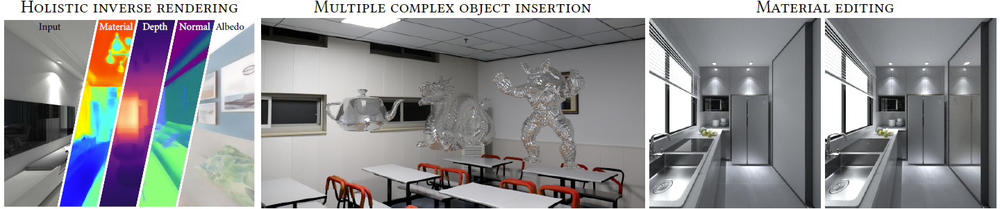

**News**

- `04/12/2022` repository created
- `31/12/2022` code release for material-geometry network
- `17/01/2023` dataset release: InteriorVerse material-geometry part
- `24/02/2023` code release for lighting network

**TODO**

- [x] Code release for Material-Geometry network
- [x] Code release for Lighting network
- [x] Release of pretrained model
- [x] Dataset release: InteriorVerse material-geometry part
- [ ] Dataset release: InteriorVerse lighting part

# Learning-based Inverse Rendering of Complex Indoor Scenes with Differentiable Monte Carlo Raytracing

### [Project Page](https://jingsenzhu.github.io/invrend/) | [Paper](https://arxiv.org/abs/2211.03017) | [Dataset](https://interiorverse.github.io/)



This repository implements the paper "Learning-Based Inverse Rendering of Complex Indoor Scenes with Differentiable Monte Carlo Raytracing" in SIGGRAPH Asia'22. It includes training and testing code of material-geometry network (MGNet) and testing code of lighting network (LightNet).

**Also check our following work: [I<sup>2</sup>-SDF](https://github.com/jingsenzhu/i2-sdf) !**

## Pretrained Models

Pretrained models are available [here](https://1drv.ms/u/s!As0jHj7lvvu5gQTjaGZu80GDAF0j?e=3KEB65), including MGNet and LightNet.

## Citation

If you find our work is useful, please consider cite:

```
@inproceedings{zhu2022learning,
    author = {Zhu, Jingsen and Luan, Fujun and Huo, Yuchi and Lin, Zihao and Zhong, Zhihua and Xi, Dianbing and Wang, Rui and Bao, Hujun and Zheng, Jiaxiang and Tang, Rui},
    title = {Learning-Based Inverse Rendering of Complex Indoor Scenes with Differentiable Monte Carlo Raytracing},
    year = {2022},
    publisher = {ACM},
    url = {https://doi.org/10.1145/3550469.3555407},
    booktitle = {SIGGRAPH Asia 2022 Conference Papers},
    articleno = {6},
    numpages = {8}
}
```

