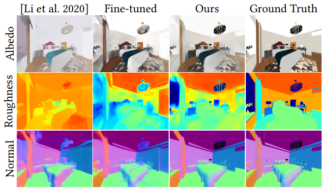

# Material-Geometry Network



## Data Convention

The dataset folder is organized as in the following structure:

```
dataset/
	scene_name_000/
		000_im.exr
		000_mask.exr
		000_albedo.exr
		000_depth.exr
		000_material.exr
		000_normal.exr
		001_im.exr
		...
	scene_name_001/
		...
	...
	train.txt
	val.txt
	test.txt
```

`scene_name_000` and `scene_name_001` are just example scene names. There is no naming conventions for scenes.

The training/validation/testing split of dataset should be specified as a list of scene names in `train/val/test.txt`

For more information, please refer to `dataLoader/__init__.py`

## Install

```
pip install -r requirements.txt
```

## Training and Evaluation

To train a model from scratch, run

```
python trainBRDF_pl.py config.yml -v <version_id>
```

The training workspace will be `exps/dense/version_<version_id>` by default.

After training, you can load the pretrained model to evaluate on the testing dataset, run

```
python trainBRDF_pl.py config.yml -v <version_id> --test
```

The pretrained model will be released soon.

## Evaluate on real images

To test the network on real images, run

```
python testBRDF_real.py config.yml -v <version_id> -p <path_to_images>
```

By default, the program will scan the image path for all images of `PNG` format. You can also manually specify the image list to be evaluated by adding `-l <image_1> <image_2> ... <image_n>`, note that all image names should basenames excluding image path. You can also use a text file to include the image list and add `--listfile <image_list>`.

## Citation

If you find our work is useful, please consider cite:

```
@inproceedings{zhu2022learning,
    author = {Zhu, Jingsen and Luan, Fujun and Huo, Yuchi and Lin, Zihao and Zhong, Zhihua and Xi, Dianbing and Wang, Rui and Bao, Hujun and Zheng, Jiaxiang and Tang, Rui},
    title = {Learning-Based Inverse Rendering of Complex Indoor Scenes with Differentiable Monte Carlo Raytracing},
    year = {2022},
    publisher = {ACM},
    url = {https://doi.org/10.1145/3550469.3555407},
    booktitle = {SIGGRAPH Asia 2022 Conference Papers},
    articleno = {6},
    numpages = {8}
}
```

## Acknowledgement

This project is built upon [PyTorch Lightning](https://www.pytorchlightning.ai/).

In this project, our implementation refers to the source code of [Li et al.'s CVPR 2020 paper](https://github.com/lzqsd/InverseRenderingOfIndoorScene). We thank the authors for their great work and code release.